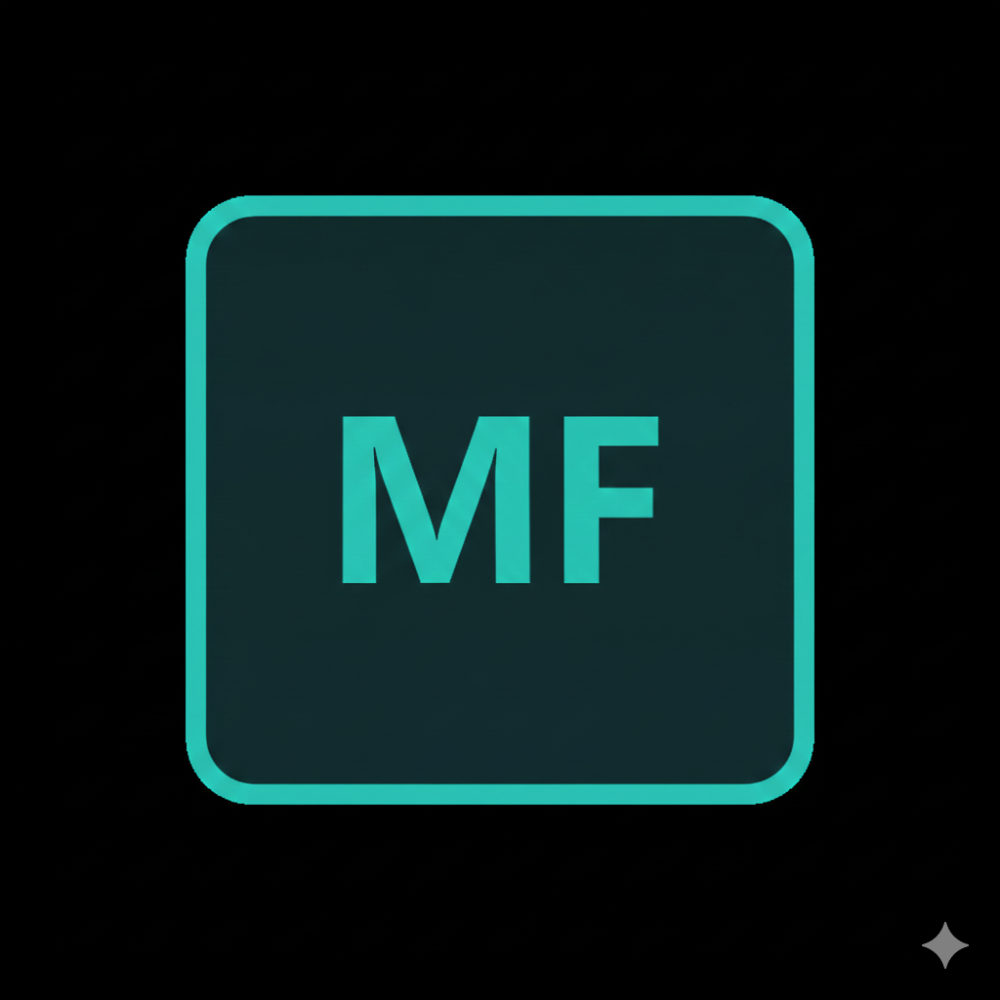
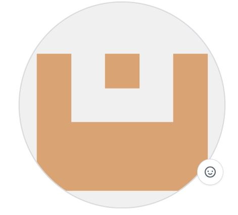

# 🚀 Portfolio Profesional — MafeTech (María Fernanda Moreno)

  
  <h1>AI Automation & Full Stack Builder</h1>
  
<b>Transformando necesidades en soluciones digitales inteligentes mediante código y automatización.</b>

  
  
  

---

## 🌟 Sobre Mí
Soy una desarrolladora enfocada en la intersección del código y la **Inteligencia Artificial** para crear soluciones que no solo se ven bien, sino que trabajan por vos. Mi enfoque principal es el **Vibe Coding**: utilizar la IA para acelerar el desarrollo y entregar productos de alta calidad en tiempos récord.

### 🎯 Lo que aporto
- **Desarrollo Full Stack (MERN):** Interfaces modernas, rápidas y escalables con React y TypeScript.
- **IA & Automatización:** Diseño de flujos de trabajo inteligentes con **n8n** y **Make** para eliminar tareas repetitivas.
- **Estrategia CX + Digital Marketing:** Soluciones orientadas a la conversión y el posicionamiento, identificando puntos de dolor del negocio.

---

## 🛠️ Tech Stack & Herramientas

### 🌐 Frontend & Backend

### 🤖 IA & Automatización

---

## 🚀 Proyectos Destacados

### 1. [Error Handling System for n8n](https://github.com/MafeTech24/production-grade-error-handling-n8n)
- **Problema:** Las automatizaciones fallan en silencio, perdiendo datos.
- **Solución:** Sistema global de alertas en tiempo real y registro de errores en Google Sheets.
- **Stack:** n8n, JavaScript, Google Sheets API, Gmail API.

### 2. [Patitas Felices — Web App](https://patitasfelices-spa.vercel.app/)
- **Problema:** Gestión manual de turnos en peluquerías caninas.
- **Solución:** Plataforma de reserva de turnos con diagnóstico inteligente e integración directa con WhatsApp.
- **Stack:** React, TypeScript, Tailwind, Framer Motion.

### 3. [Emily Hair Studio](https://emilyhairstudio.vercel.app/)
- **Problema:** Consultas de clientes sin contexto ni datos estructurados.
- **Solución:** Diagnóstico capilar inteligente que genera pedidos estructurados para el salón.
- **Stack:** React, TypeScript, Vite, WhatsApp Deep Linking.

---

## 📈 Mi Evolución (Formación)
- **Fullstack MERN** | Coderhouse diciembre 2024 - Enero 2026
- **AI Automation & Vibe Coding** | Coderhouse (Enero 2026)
- **Marketing Digital & Community Manager** | Coderhouse (2025)
- **Diplomatura E-commerce & Redes Sociales** | UTN Córdoba (2021)

---

## 📄 Especificaciones Técnicas (SRS)
Este proyecto sigue una estructura inspirada en el estándar **IEEE 830**. Podés consultar los requisitos detallados, casos de uso y matriz de trazabilidad en la sección correspondiente del código o en la versión extendida de la documentación.

---

  
Hecho por <b>María Fernanda Moreno</b>

  
Continuamente actualizado

